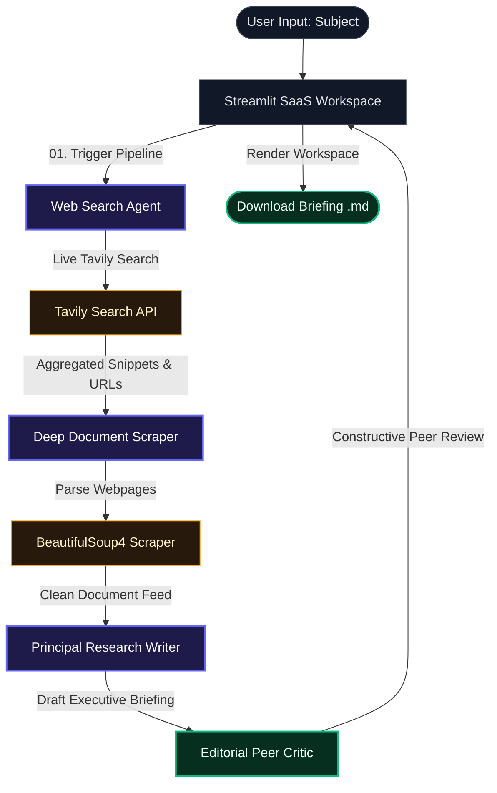

# 🔬 ResearchMind

<div align="center">

[](https://python.org)
[](https://streamlit.io)
[](https://langchain.com)
[](https://mistral.ai)
[](https://tavily.com)

**An advanced, multi-agent AI research briefing dashboard that collaborates sequentially to generate professional, peer-reviewed intelligence briefings on any topic.**

[Explore Features](#-key-features) • [Orchestration Flow](#-agentic-orchestration-flow) • [Quick Start](#-quick-start) • [Deployment](#-cloud-deployment)

</div>

---

## 📌 Project Preview

<div align="center">
  <!-- Place your stunning SaaS dashboard screenshot here -->
  
  <p><em>Premium obsidian-themed SaaS Workspace displaying real-time dynamic agent executions.</em></p>
</div>

---

## ⚡ Key Features

- **Collaborative Agent Network**: Orchestrates four specialized AI agents to crawl, extract, write, and validate research data.
- **Dynamic Real-Time Pipeline**: Dynamic, sequential UI state updates using Streamlit session state and stage transitions (`WAITING` ➔ `ACTIVE` ➔ `COMPLETE`).
- **Resilient Rate-Limiting**: Built-in cooling buffers (`time.sleep`) to seamlessly execute complex pipelines even on free-tier API accounts without triggering HTTP 429 errors.
- **Supportive Editorial Peer-Review**: Automatic constructive critique of your reports with generous grading scores and encouraging verdicts.
- **Instant Markdown Downloads**: Save and download beautifully generated intelligence briefs directly from your dashboard in standard Markdown format.

---

## 🛠️ Tech Stack

- **Frontend & Interface**: [Streamlit](https://streamlit.io) (Custom HSL Dark Mode CSS + Glassmorphism UI Layouts)
- **Agent Orchestration**: [LangChain Ecosystem](https://github.com/langchain-ai/langchain)
- **Large Language Model**: [Mistral AI](https://mistral.ai) (`ChatMistralAI` Native Integration)
- **Web Crawling**: [Tavily API](https://tavily.com) (Structured Search Engine) & BeautifulSoup4 (Custom Document Parser)

---

## 🔬 Agentic Orchestration Flow



---

## 👥 Meet Your AI Research Team

| Agent | Technology | Core Functionality |
| :--- | :--- | :--- |
| **01. Web Search Agent** | `TavilyClient` | Scans live search indexes and groups primary resources. |
| **02. Deep Document Scraper** | BeautifulSoup4 | Decomposes stylesheets and cleans navigation structures for deep content. |
| **03. Principal Research Writer** | LangChain LLM | Synthesizes raw text feeds and drafts professional intelligence briefs. |
| **04. Editorial Peer Critic** | LangChain LLM | Performs structured quality checks, issues score cards, and suggests enhancements. |

---

## 🚀 Quick Start

### 1. Clone the Repository
```bash
git clone https://github.com/RachakondaGagan/Multi-Agent-AI-Research-System.git
cd Multi-Agent-AI-Research-System
```

### 2. Configure Environment Secrets
Create a `.env` file in the root directory:
```env
TAVILY_API_KEY = "your-tavily-api-key"
MISTRAL_API_KEY = "your-mistral-api-key"
```

### 3. Install Dependencies & Run
Setup your virtual environment and launch the dashboard:
```bash
python3 -m venv .venv
source .venv/bin/activate
pip install -r requirements.txt
streamlit run app.py
```

---

## ☁️ Cloud Deployment

You can deploy this dashboard to the cloud completely for free in under 2 minutes using **Streamlit Community Cloud**:

1. Log in to [share.streamlit.io](https://share.streamlit.io/).
2. Click **New app** and connect your repository: `RachakondaGagan/Multi-Agent-AI-Research-System`.
3. In **Advanced Settings ➔ Secrets**, paste your API environment variables:
   ```toml
   TAVILY_API_KEY = "your-tavily-api-key"
   MISTRAL_API_KEY = "your-mistral-api-key"
   ```
4. Click **Deploy!**

---

## 📜 License
This project is licensed under the MIT License - see the [LICENSE](LICENSE) file for details.
